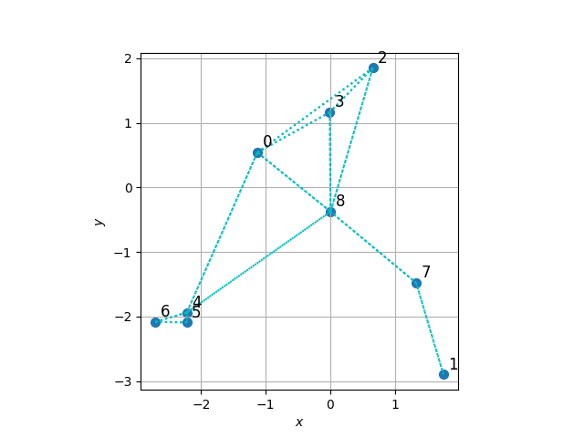
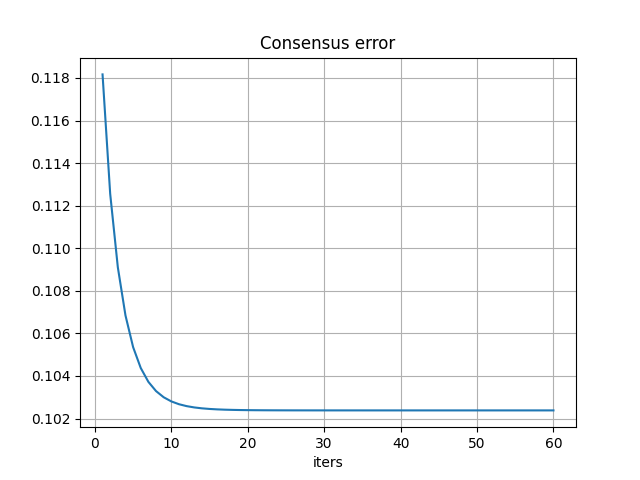
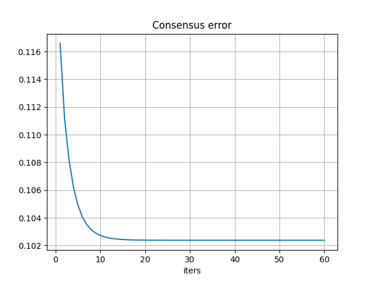
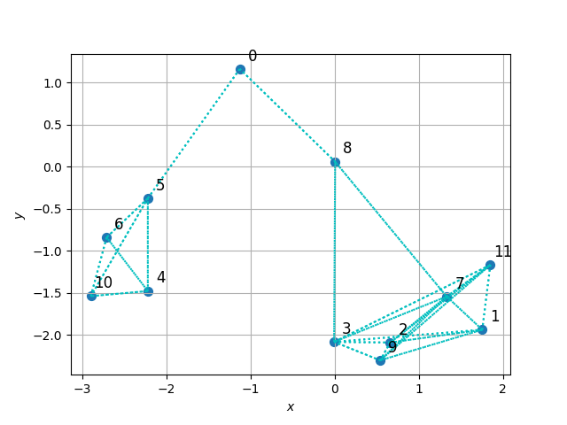
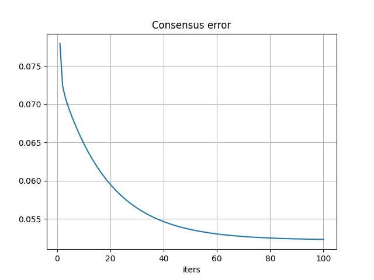
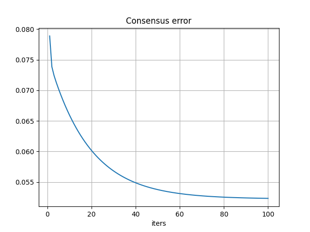
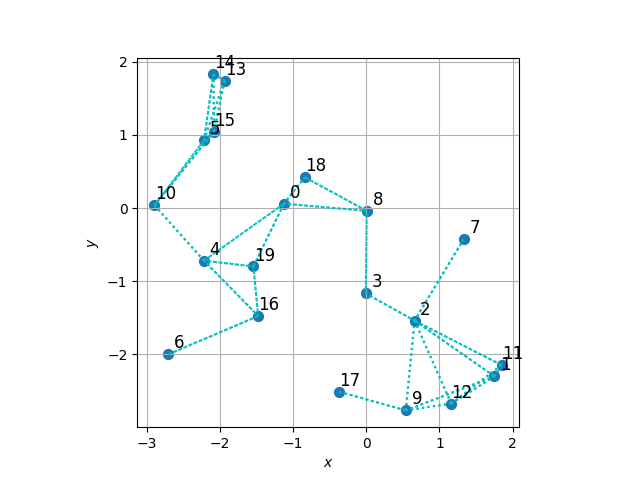
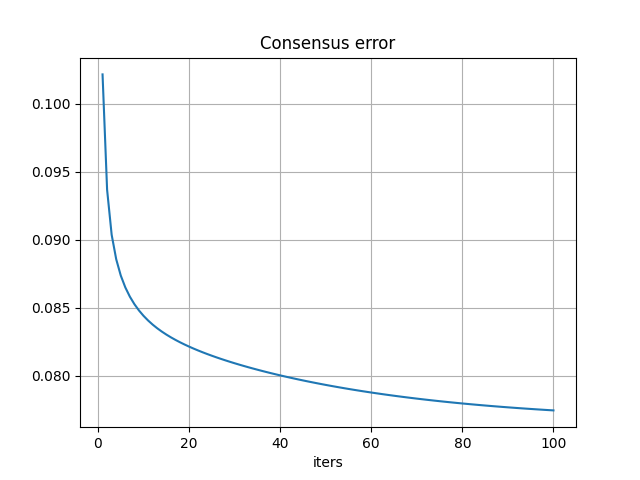
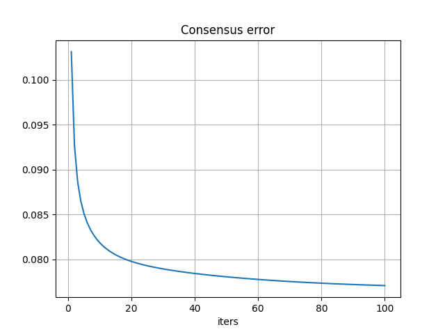

# Multi-Agent Optimization for Distributed Learning

Multi-agent optimization for distributed least-squares regression with some real-world complications.

<details open>
<summary>Code organization</summary>

Code inside `src/` folder

- `configs/` folder with yaml configuration files
- `plots/` folder with plotted results
- `cmd_args.py` arguments for main programs
- `main.py` main program with arguments, see `python main.py --help` (for now just the configuration file)
- `mydata.py` utilities for dataset creation
- `network.py` utilities for multi-agent network creation, contains `random_nodes()` `connect_agents()` `plot_network()` functions
- `train.py` utilities for agents training and consensus algorithm, contains `Agent` class and `consensus_algorithm()` function
- `utils.py` other utilities

</details>

You can run the main program as follows (also works for `network.py` and `mydata.py` for inspecting agents network and data respectively)

```bash
python main.py --config configs/exp1.yaml
```

## :spider_web: Distributed learning

The learning problem is the least-squares regression, it can be solved in closed form.

The complication here is that being a distributed problem, there are global features that are shared between all the agents and local features that only each agent has access to, which are specific of the local data. In this example we have 2 shared features (coefficients) and a single local feature (bias).

The idea is to solve the local least-squares problems and then align all the solution with the consensus algorithm like in a federated learning setting. See [math.pdf](math.pdf) for the mathematical part (markdown has problems rendering math formulas) and pseudocode too.

### :file_folder: Custom dataset

We explore two dataset scenarios

Scenario 1 | Scenario 2
---------- | ----------
$x_{1k}\sim\mathcal{U}([-10,10])$ | $x_{2k}\sim\mathcal{U}([-1,1])$
$x_{1k}\sim\mathcal{U}([-1,1])$ | $x_{2k}\sim\mathcal{U}([-10,10])$ 
$\varepsilon_k\sim\mathcal{N}(0,0.8)$ | $\varepsilon_k\sim\mathcal{N}(0,0.8)$

In both scenarios we generate the parameters in the same way, we may want to see the effect of changing the covariates data generating process.

### :busts_in_silhouette: Multi-agent system

We need to define a network topology and specify the number of agents, based on the topology there could be more parameters to set.

There are various possibilities, here we consider the **ring** (named `random`, see `network.ring_nodes()`) topology where the nodes are displayed in a circle shape, and between two nodes there will be a connection if their distance is less than a threshold.
<!-- - Geometric: generate random 2D coordinates the connect two agents if their distance is below a given threshold (see `network.random_nodes()`)
- Ring: display the nodes in a circle (see `network.ring_nodes`) as the previous the threshold should be provided here too -->

For example we can set in the YAML file: `topology: random` `n_agents: 10` `dist_thresh: 3.3` that corresponds to the geometric topology with 10 agents and a distance threshold of 3.3 between two agents under which they will be connected (added to the neighbors list respectively, available in `Agent.neighbors`).

When adding agents to the neighbors list, the `Agent.update_neighbors()` method must be called, this also updates the consensus weights for the current agent. We choose to use the Metropolis weights since we only want to exploit local informations available to all agents.

Having $\mathcal{N}_i$ as the list of neighbors for the agent $i$, we can access the neighbors list as follows

```python
agent_i = Agent(1, features_i, targets_i)
# get distance matric for the network topology
# connect agents given the network with network.connect_agents()
for neighbor in agent.neighbors:
    print(neighbor)  # see `__str__` method
    print(neighbor.metropolis)  # directly access metropolis weights
```

### :mailbox_with_mail: Consensus algorithm

The full dataset is split between each agent, i.e. each agent has a fraction of indices, this is handled with utilities in `mydata.py` when calling `get_dataset()` and using the `dataset_fun()` output from the main program. The output `agent_splits` is a list of dictionary where each containts local features and targets for each agent.

Once we have the data, we can proceed with solving the local least-squares problem as follows, where the `.fit()` method initializes variables for the consesus algorithm too.

```python
agents = [Agent(1, features_1, targets_1), Agent(2, features_2, targets_2)]
# get distance matrix for the network topology
# connect agents with `connect_agents()` updating neighbors list
for agent in agents:
    agent.fit()
    # automatically prints local solution w_i
    # then RMSE and R2 metrics using sklearn
```

Once we have the local solution for all agents (`agent.fit()`), we may proceed with the consensus algorithm for the common part of the weights, starting with

```python
for l in range(opts.maxiter):
    for agent in agents:
        # single consensus step for each agent
        # stores solution elsewhere util all agents make a step
        agent.consensus_step()
        # updates `q_1i_next` `omega_1i_next` (buffer)
    for agent in agents:
        # update consensus variables effectively
        agent.sync()
        # updates `q_1i` `omega_1i` `w_i`
```

Eventually we can update the agent-specific parameters (just bias here) having the common part updated after consensus

```python
for agent in agents:
    # updates local bias stored in agent.mu_i_new[-1]
    agent.local_consensus()
```

## :chart_with_downwards_trend: Results

Here we provide results for working examples

### :one: Network with 9 agents

Network | Scenario 1 | Scenario 2
------- | ---------- | ----------
 |  | 

<details>
<summary>Configuration file</summary>

- `seed: 42`
- `dataset: dataset1` then `dataset2`
- `n_samples: 12000`
- `n_agents: 9`
- `topology: random`
- `grid_size: 5`
- `dist_thresh: 2.8`
- `maxiter: 60`
- `experiment_name: data1_rand9` then `data2_rand9`
- `log_every: 15`

</details>

<details>
<summary>Logging</summary>

<table>
<tr>
<th>Scenario 1</th>
<th>Scenario 2</th>
</tr>
<tr>
<td>

```bash
Synthetic w_i_avg=[ 0.5637 -1.4668  0.3939]

Local w_i_avg=[ 0.5631 -1.4813  0.3893] RMSE_avg=0.79 R2_avg=0.91

Iteration [001/60] cons_err=0.118168
  w_i_avg=[ 0.5763 -1.473   0.3893] RMSE_avg=1.34 R2_avg=0.37
Iteration [016/60] cons_err=0.102429
  w_i_avg=[ 0.5614 -1.447   0.3893] RMSE_avg=1.43 R2_avg=0.10
Iteration [031/60] cons_err=0.102381
  w_i_avg=[ 0.5607 -1.4461  0.3893] RMSE_avg=1.44 R2_avg=0.09
Iteration [046/60] cons_err=0.102381
  w_i_avg=[ 0.5606 -1.446   0.3893] RMSE_avg=1.44 R2_avg=0.09
Iteration [060/60] cons_err=0.102381
  w_i_avg=[ 0.5606 -1.446   0.3893] RMSE_avg=1.44 R2_avg=0.09

w_i_avg=[ 0.5606 -1.446   0.3947] RMSE_avg=1.44 R2_avg=0.09
```

</td>
<td>

```bash
Synthetic w_i_avg=[ 0.5637 -1.4668  0.3939]

Local w_i_avg=[ 0.5581 -1.4683  0.3893] RMSE_avg=0.79 R2_avg=0.99

Iteration [001/60] cons_err=0.116577
  w_i_avg=[ 0.5865 -1.458   0.3893] RMSE_avg=1.26 R2_avg=0.95
Iteration [016/60] cons_err=0.102419
  w_i_avg=[ 0.5718 -1.4335  0.3893] RMSE_avg=1.37 R2_avg=0.94
Iteration [031/60] cons_err=0.102381
  w_i_avg=[ 0.571  -1.4326  0.3893] RMSE_avg=1.37 R2_avg=0.94
Iteration [046/60] cons_err=0.102381
  w_i_avg=[ 0.571  -1.4326  0.3893] RMSE_avg=1.37 R2_avg=0.94
Iteration [060/60] cons_err=0.102381
  w_i_avg=[ 0.571  -1.4326  0.3893] RMSE_avg=1.37 R2_avg=0.94

w_i_avg=[ 0.571  -1.4326  0.3786] RMSE_avg=1.37 R2_avg=0.94
```

</td>
</tr>
</table>

</details>


### :two: Network with 12 agents

Network | Scenario 1 | Scenario 2
------- | ---------- | ----------
 |  | 


<details>
<summary>Configuration file</summary>

- `seed: 42`
- `dataset: dataset1` then `dataset2`
- `n_samples: 20000`
- `n_agents: 12`
- `topology: random`
- `grid_size: 5`
- `dist_thresh: 2.2`
- `maxiter: 100`
- `experiment_name: data1_rand12` and `data2_rand12`
- `log_every: 15`

</details>

<details>
<summary>Logging</summary>

<table>
<tr>
<th>Scenario 1</th>
<th>Scenario 2</th>
</tr>
<tr>
<td>

```bash
Synthetic w_i_avg=[ 0.6253 -1.6316  0.1697]

Local w_i_avg=[ 0.6264 -1.6359  0.1679] RMSE_avg=0.80 R2_avg=0.91

Iteration [001/100] cons_err=0.077981
  w_i_avg=[ 0.6327 -1.6719  0.1679] RMSE_avg=1.83 R2_avg=0.43
Iteration [016/100] cons_err=0.061298
  w_i_avg=[ 0.6341 -1.6904  0.1679] RMSE_avg=2.00 R2_avg=0.31
Iteration [031/100] cons_err=0.056201
  w_i_avg=[ 0.6306 -1.6992  0.1679] RMSE_avg=1.99 R2_avg=0.32
Iteration [046/100] cons_err=0.053975
  w_i_avg=[ 0.6284 -1.7049  0.1679] RMSE_avg=1.99 R2_avg=0.32
Iteration [061/100] cons_err=0.053000
  w_i_avg=[ 0.6269 -1.7087  0.1679] RMSE_avg=1.99 R2_avg=0.32
Iteration [076/100] cons_err=0.052573
  w_i_avg=[ 0.6259 -1.7112  0.1679] RMSE_avg=1.99 R2_avg=0.32
Iteration [091/100] cons_err=0.052386
  w_i_avg=[ 0.6253 -1.7128  0.1679] RMSE_avg=1.99 R2_avg=0.32
Iteration [100/100] cons_err=0.052329
  w_i_avg=[ 0.625  -1.7135  0.1679] RMSE_avg=2.00 R2_avg=0.32

w_i_avg=[ 0.625  -1.7135  0.2067] RMSE_avg=1.99 R2_avg=0.32
```

</td>
<td>

```bash
Synthetic w_i_avg=[ 0.6253 -1.6316  0.1697]

Local w_i_avg=[ 0.6371 -1.632   0.1679] RMSE_avg=0.80 R2_avg=0.99

Iteration [001/100] cons_err=0.078895
  w_i_avg=[ 0.6363 -1.6396  0.1679] RMSE_avg=1.87 R2_avg=0.95
Iteration [016/100] cons_err=0.062099
  w_i_avg=[ 0.6377 -1.6566  0.1679] RMSE_avg=1.97 R2_avg=0.94
Iteration [031/100] cons_err=0.056568
  w_i_avg=[ 0.635  -1.6659  0.1679] RMSE_avg=2.01 R2_avg=0.94
Iteration [046/100] cons_err=0.054140
  w_i_avg=[ 0.6335 -1.672   0.1679] RMSE_avg=2.03 R2_avg=0.93
Iteration [061/100] cons_err=0.053074
  w_i_avg=[ 0.6327 -1.6761  0.1679] RMSE_avg=2.05 R2_avg=0.93
Iteration [076/100] cons_err=0.052606
  w_i_avg=[ 0.6321 -1.6789  0.1679] RMSE_avg=2.07 R2_avg=0.93
Iteration [091/100] cons_err=0.052400
  w_i_avg=[ 0.6318 -1.6807  0.1679] RMSE_avg=2.08 R2_avg=0.93
Iteration [100/100] cons_err=0.052337
  w_i_avg=[ 0.6317 -1.6815  0.1679] RMSE_avg=2.08 R2_avg=0.93

w_i_avg=[ 0.6317 -1.6815  0.1684] RMSE_avg=2.08 R2_avg=0.93
```

</td>
</tr>
</table>

</details>


### :three: Network with 20 agents

Network | Scenario 1 | Scenario 2
------- | ---------- | ----------
 |  | 


<details>
<summary>Configuration file</summary>

- `seed: 42`
- `dataset: dataset1` and `dataset2`
- `n_samples: 40000`
- `n_agents: 20`
- `topology: random`
- `grid_size: 5`
- `dist_thresh: 1.35`
- `maxiter: 100`
- `experiment_name: data1_rand20` and `data2_rand20`
- `log_every: 15`

</details>

<details>
<summary>Logging</summary>

<table>
<tr>
<th>Scenario 1</th>
<th>Scenario 2</th>
</tr>
<tr>
<td>

```bash
Synthetic w_i_avg=[ 0.4081 -1.5619  0.2113]

Local w_i_avg=[ 0.4087 -1.5707  0.2119] RMSE_avg=0.80 R2_avg=0.86

Iteration [001/100] cons_err=0.102139
  w_i_avg=[ 0.4029 -1.5829  0.2119] RMSE_avg=1.43 R2_avg=0.36
Iteration [016/100] cons_err=0.082837
  w_i_avg=[ 0.4161 -1.5796  0.2119] RMSE_avg=1.61 R2_avg=0.03
Iteration [031/100] cons_err=0.080833
  w_i_avg=[ 0.4241 -1.579   0.2119] RMSE_avg=1.62 R2_avg=-0.02
Iteration [046/100] cons_err=0.079604
  w_i_avg=[ 0.4305 -1.5787  0.2119] RMSE_avg=1.62 R2_avg=-0.05
Iteration [061/100] cons_err=0.078734
  w_i_avg=[ 0.4357 -1.5786  0.2119] RMSE_avg=1.63 R2_avg=-0.08
Iteration [076/100] cons_err=0.078113
  w_i_avg=[ 0.44   -1.5785  0.2119] RMSE_avg=1.63 R2_avg=-0.11
Iteration [091/100] cons_err=0.077672
  w_i_avg=[ 0.4436 -1.5785  0.2119] RMSE_avg=1.63 R2_avg=-0.13
Iteration [100/100] cons_err=0.077471
  w_i_avg=[ 0.4454 -1.5786  0.2119] RMSE_avg=1.64 R2_avg=-0.14

w_i_avg=[ 0.4454 -1.5786  0.2365] RMSE_avg=1.64 R2_avg=-0.14
```

</td>
<td>

```bash
Synthetic w_i_avg=[ 0.4081 -1.5619  0.2113]

Local w_i_avg=[ 0.4143 -1.5628  0.2119] RMSE_avg=0.80 R2_avg=0.99

Iteration [001/100] cons_err=0.103146
  w_i_avg=[ 0.3888 -1.5606  0.2119] RMSE_avg=1.63 R2_avg=0.96
Iteration [016/100] cons_err=0.080319
  w_i_avg=[ 0.3988 -1.5614  0.2119] RMSE_avg=1.64 R2_avg=0.96
Iteration [031/100] cons_err=0.078863
  w_i_avg=[ 0.405  -1.5619  0.2119] RMSE_avg=1.65 R2_avg=0.96
Iteration [046/100] cons_err=0.078180
  w_i_avg=[ 0.4097 -1.5625  0.2119] RMSE_avg=1.65 R2_avg=0.96
Iteration [061/100] cons_err=0.077725
  w_i_avg=[ 0.4135 -1.5631  0.2119] RMSE_avg=1.65 R2_avg=0.96
Iteration [076/100] cons_err=0.077401
  w_i_avg=[ 0.4166 -1.5636  0.2119] RMSE_avg=1.65 R2_avg=0.96
Iteration [091/100] cons_err=0.077170
  w_i_avg=[ 0.4192 -1.564   0.2119] RMSE_avg=1.65 R2_avg=0.96
Iteration [100/100] cons_err=0.077065
  w_i_avg=[ 0.4205 -1.5643  0.2119] RMSE_avg=1.65 R2_avg=0.96

w_i_avg=[ 0.4205 -1.5643  0.2149] RMSE_avg=1.65 R2_avg=0.96
```
</td>
</tr>
</table>

</details>
