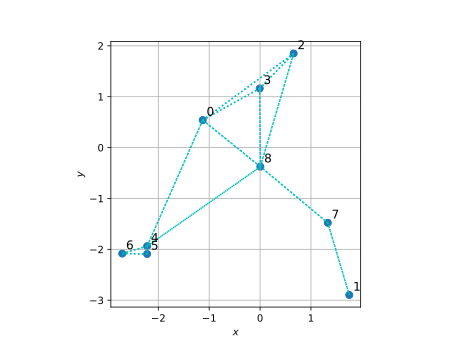
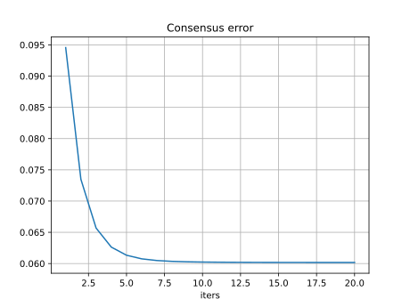
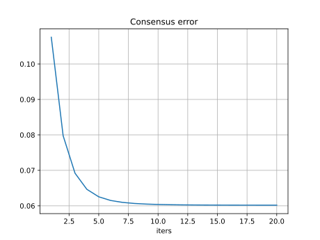
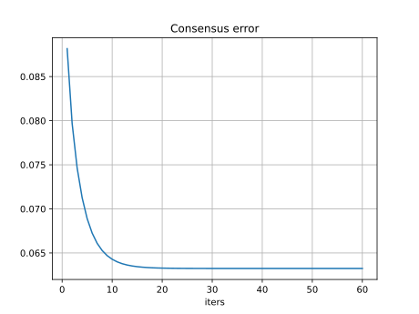
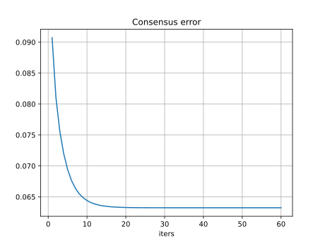
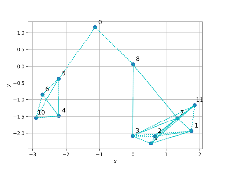
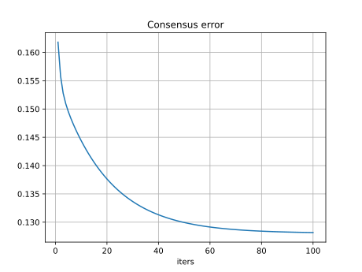
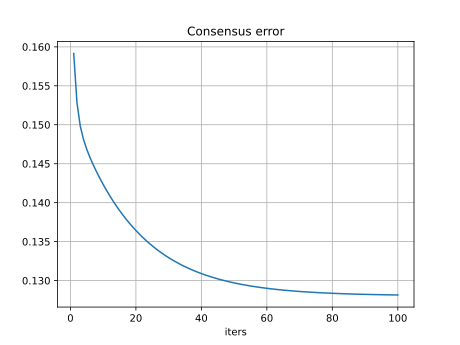
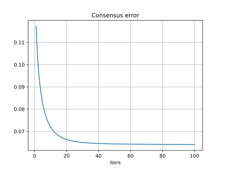
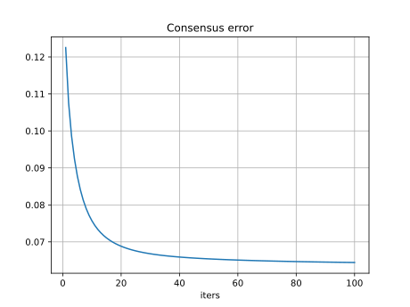

# Multi-Agent Optimization for Distributed Learning

Multi-agent optimization for distributed least-squares regression with some real-world complications.

<details>
<summary>Code organization</summary>

```bash
pip install -r requirements.txt
```

- `configs/` folder with yaml configuration files
- `plots/` folder with plotted results
- `cmd_args.py` arguments for main programs
- `main.py` main program with arguments, see `python main.py --help` (for now just the configuration file)
- `mydata.py` utilities for dataset creation
- `network.py` utilities for multi-agent network creation, contains `random_nodes()` `connect_agents()` `plot_network()` functions
- `train.py` utilities for agents training and consensus algorithm, contains `Agent` class and `consensus_algorithm()` function
- `utils.py` other utilities

You can run the main program as follows (also works for `network.py` and `mydata.py` for inspecting agents network and data respectively)

```bash
python main.py --config configs/exp1.yaml
```

</details>

## :spider_web: Distributed learning

The learning problem is the least-squares regression, it can be solved in closed form.

The complication here is that being a distributed problem, there are global features that are shared between all the agents and local features that only each agent has access to, which are specific of the local data. In this example we have 2 shared features (coefficients) and a single local feature (bias).

The idea is to solve the local least-squares problems and then align all the solution with the consensus algorithm like in a federated learning setting. See [math.pdf](math.pdf) for the mathematical part (markdown has problems rendering math formulas) and pseudocode too.

### :file_folder: Custom dataset

We explore two dataset scenarios

Scenario 1 | Scenario 2
---------- | ----------
$x_{1k}\sim\mathcal{U}([-10,10])$ | $x_{1k}\sim\mathcal{U}([-1,1])$
$x_{2k}\sim\mathcal{U}([-1,1])$ | $x_{2k}\sim\mathcal{U}([-10,10])$
$\varepsilon_k\sim\mathcal{N}(0,0.8)$ | $\varepsilon_k\sim\mathcal{N}(0,0.8)$

In both scenarios we generate the parameters in the same way, we may want to see the effect of changing the covariates data generating process.

### :busts_in_silhouette: Multi-agent system

We need to define a network topology and specify the number of agents, based on the topology there could be more parameters to set.

There are various possibilities, here we consider the **ring** (named `random`, see `network.ring_nodes()`) topology where the nodes are displayed in a circle shape, and between two nodes there will be a connection if their distance is less than a threshold.
<!-- - Geometric: generate random 2D coordinates the connect two agents if their distance is below a given threshold (see `network.random_nodes()`)
- Ring: display the nodes in a circle (see `network.ring_nodes`) as the previous the threshold should be provided here too -->

For example we can set in the YAML file: `topology: random` `n_agents: 10` `dist_thresh: 3.3` that corresponds to the geometric topology with 10 agents and a distance threshold of 3.3 between two agents under which they will be connected (added to the neighbors list respectively, available in `Agent.neighbors`).

When adding agents to the neighbors list, the `Agent.update_neighbors()` method must be called, this also updates the consensus weights for the current agent. We choose to use the Metropolis weights since we only want to exploit local informations available to all agents.

Having $\mathcal{N}_i$ as the list of neighbors for the agent $i$, we can access the neighbors list as follows

```python
agent_i = Agent(1, features_i, targets_i)
# get distance matric for the network topology
# connect agents given the network with network.connect_agents()
for neighbor in agent.neighbors:
    print(neighbor)  # see `__str__` method
    print(neighbor.metropolis)  # directly access metropolis weights
```

### :mailbox_with_mail: Consensus algorithm

The full dataset is split between each agent, i.e. each agent has a fraction of indices, this is handled with utilities in `mydata.py` when calling `get_dataset()` and using the `dataset_fun()` output from the main program. The output `agent_splits` is a list of dictionary where each containts local features and targets for each agent.

Once we have the data, we can proceed with solving the local least-squares problem as follows, where the `.fit()` method initializes variables for the consesus algorithm too.

```python
agents = [Agent(1, features_1, targets_1), Agent(2, features_2, targets_2)]
# get distance matrix for the network topology
# connect agents with `connect_agents()` updating neighbors list
for agent in agents:
    agent.fit()
    # automatically prints local solution w_i
    # then RMSE and R2 metrics using sklearn
```

Once we have the local solution for all agents (`agent.fit()`), we may proceed with the consensus algorithm for the common part of the weights, starting with

```python
for l in range(opts.maxiter):
    for agent in agents:
        # single consensus step for each agent
        # stores solution elsewhere util all agents make a step
        agent.consensus_step()
        # updates `q_1i_next` `omega_1i_next` (buffer)
    for agent in agents:
        # update consensus variables effectively
        agent.sync()
        # updates `q_1i` `omega_1i` `w_i`
```

Eventually we can update the agent-specific parameters (just bias here) having the common part updated after consensus

```python
for agent in agents:
    # updates local bias stored in agent.mu_i_new[-1]
    agent.local_consensus()
```

## :chart_with_downwards_trend: Results

Here we provide results for working examples

### :one: Network with 5 agents

Network | Scenario 1 | Scenario 2
------- | ---------- | ----------
 |  | 

<details>
<summary>Logging</summary>

<table style="width:100%">
<tr>
  <th style="width:100px">Scenario 1</th>
  <th style="width:50%">Scenario 2</th>
</tr>
<tr>
<td>

```bash
python main.py --config configs/data1_random5.yaml

Agent 0, w_i=[ 0.0295 -1.8558  0.323 ]
Agent 1, w_i=[ 0.5507 -1.634  -0.0421]
Agent 2, w_i=[ 0.7013 -0.7655  0.5358]
Agent 3, w_i=[ 0.2796 -1.5236  0.3087]
Agent 4, w_i=[ 0.4573 -1.7269 -0.149 ]
Synthetic w_i_avg=[ 0.4037 -1.5012  0.1952]

Agent 0 local solution w_i=[ 0.0329 -1.8158  0.3479], RMSE=0.82, R2=0.64
Agent 1 local solution w_i=[ 0.549  -1.7424 -0.0462], RMSE=0.76, R2=0.95
Agent 2 local solution w_i=[ 0.6983 -0.7828  0.5043], RMSE=0.78, R2=0.97
Agent 3 local solution w_i=[ 0.2796 -1.5284  0.3016], RMSE=0.80, R2=0.83
Agent 4 local solution w_i=[ 0.4552 -1.7727 -0.14  ], RMSE=0.78, R2=0.93
Local w_i_avg=[ 0.403  -1.5284  0.1935] RMSE_avg=0.79 R2_avg=0.86
Iteration [001/20] cons_err=0.094565
  w_i_avg=[ 0.3864 -1.5349  0.1935] RMSE_avg=1.23 R2_avg=0.57
Iteration [006/20] cons_err=0.060753
  w_i_avg=[ 0.3793 -1.5598  0.1935] RMSE_avg=1.47 R2_avg=0.36
Iteration [011/20] cons_err=0.060214
  w_i_avg=[ 0.3794 -1.5621  0.1935] RMSE_avg=1.47 R2_avg=0.35
Iteration [016/20] cons_err=0.060175
  w_i_avg=[ 0.3796 -1.5622  0.1935] RMSE_avg=1.47 R2_avg=0.34
Iteration [020/20] cons_err=0.060170
  w_i_avg=[ 0.3796 -1.5622  0.1935] RMSE_avg=1.47 R2_avg=0.34

Agent 0, w_i=[ 0.3789 -1.5628  0.4161], RMSE=2.18, R2=-1.59
Agent 1, w_i=[ 0.3781 -1.5634 -0.0198], RMSE=1.26, R2=0.86
Agent 2, w_i=[ 0.3803 -1.5616  0.4922], RMSE=2.03, R2=0.76
Agent 3, w_i=[ 0.3801 -1.5618  0.32  ], RMSE=0.99, R2=0.75
Agent 4, w_i=[ 0.3808 -1.5613 -0.1474], RMSE=0.90, R2=0.90
w_i_avg=[ 0.3796 -1.5622  0.2122] RMSE_avg=1.47 R2_avg=0.34

```

</td>
<td>

```bash
python main.py --config configs/data2_random5.yaml

Agent 0, w_i=[ 0.0295 -1.8558  0.323 ]
Agent 1, w_i=[ 0.5507 -1.634  -0.0421]
Agent 2, w_i=[ 0.7013 -0.7655  0.5358]
Agent 3, w_i=[ 0.2796 -1.5236  0.3087]
Agent 4, w_i=[ 0.4573 -1.7269 -0.149 ]
Synthetic w_i_avg=[ 0.4037 -1.5012  0.1952]

Agent 0 local solution w_i=[ 0.0637 -1.8518  0.3479], RMSE=0.82, R2=0.99
Agent 1 local solution w_i=[ 0.5336 -1.6449 -0.0462], RMSE=0.76, R2=0.99
Agent 2 local solution w_i=[ 0.6715 -0.7673  0.5043], RMSE=0.78, R2=0.97
Agent 3 local solution w_i=[ 0.28   -1.5241  0.3016], RMSE=0.80, R2=0.99
Agent 4 local solution w_i=[ 0.4367 -1.7315 -0.14  ], RMSE=0.78, R2=0.99
Local w_i_avg=[ 0.3971 -1.5039  0.1935] RMSE_avg=0.79 R2_avg=0.99
Iteration [001/20] cons_err=0.107554
  w_i_avg=[ 0.3698 -1.5361  0.1935] RMSE_avg=1.23 R2_avg=0.94
Iteration [006/20] cons_err=0.061508
  w_i_avg=[ 0.3554 -1.5652  0.1935] RMSE_avg=1.78 R2_avg=0.80
Iteration [011/20] cons_err=0.060313
  w_i_avg=[ 0.3553 -1.5671  0.1935] RMSE_avg=1.86 R2_avg=0.78
Iteration [016/20] cons_err=0.060191
  w_i_avg=[ 0.3553 -1.5669  0.1935] RMSE_avg=1.87 R2_avg=0.78
Iteration [020/20] cons_err=0.060174
  w_i_avg=[ 0.3552 -1.5668  0.1935] RMSE_avg=1.88 R2_avg=0.77

Agent 0, w_i=[ 0.3555 -1.5685  0.3623], RMSE=1.83, R2=0.97
Agent 1, w_i=[ 0.3558 -1.5703 -0.0337], RMSE=0.88, R2=0.99
Agent 2, w_i=[ 0.355  -1.5653  0.2245], RMSE=4.61, R2=-0.06
Agent 3, w_i=[ 0.3551 -1.5658  0.2917], RMSE=0.84, R2=0.99
Agent 4, w_i=[ 0.3548 -1.5642 -0.1303], RMSE=1.23, R2=0.98
w_i_avg=[ 0.3552 -1.5668  0.1429] RMSE_avg=1.88 R2_avg=0.78
```

</td>
</tr>
</table>

</details>


### :one: Network with 9 agents

Network | Scenario 1 | Scenario 2
------- | ---------- | ----------
 |  | 

<details>
<summary>Logging</summary>

Here we see firstly `Synthetic w_i_avg` that is the mean over the actual parameters, then `Local w_i_avg` that is the same mean after the local least-squares problem were solved. The consensus algorithm starts and metrics are printed every `log_avery` iterations, once the consensus has ended, the local bias is updated and the mean over each agent parameters is printed together with regression metrics.

<table style="width:100%">
<tr>
  <th style="width:100px">Scenario 1</th>
  <th style="width:50%">Scenario 2</th>
</tr>
<tr>
<td>

```bash
python main.py --config configs/data1_random9.yaml

Synthetic w_i_avg=[ 0.3001 -1.424   0.2727]

Local w_i_avg=[ 0.3004 -1.4136  0.2763] RMSE_avg=0.80 R2_avg=0.78
Iteration [001/60] cons_err=0.088167
  w_i_avg=[ 0.2863 -1.4268  0.2763] RMSE_avg=1.09 R2_avg=0.43
Iteration [016/60] cons_err=0.063389
  w_i_avg=[ 0.2641 -1.4071  0.2763] RMSE_avg=1.24 R2_avg=0.41
Iteration [031/60] cons_err=0.063242
  w_i_avg=[ 0.2634 -1.4058  0.2763] RMSE_avg=1.25 R2_avg=0.40
Iteration [046/60] cons_err=0.063241
  w_i_avg=[ 0.2633 -1.4057  0.2763] RMSE_avg=1.25 R2_avg=0.40
Iteration [060/60] cons_err=0.063241
  w_i_avg=[ 0.2633 -1.4056  0.2763] RMSE_avg=1.25 R2_avg=0.40

w_i_avg=[ 0.2633 -1.4056  0.2744] RMSE_avg=1.25 R2_avg=0.40
```

</td>
<td>

```bash
python main.py --config configs/data2_random9.yaml

Synthetic w_i_avg=[ 0.3001 -1.424   0.2727]

Local w_i_avg=[ 0.3031 -1.4229  0.2763] RMSE_avg=0.80 R2_avg=0.99
Iteration [001/60] cons_err=0.090728
  w_i_avg=[ 0.2773 -1.4134  0.2763] RMSE_avg=1.68 R2_avg=0.94
Iteration [016/60] cons_err=0.063407
  w_i_avg=[ 0.2621 -1.3881  0.2763] RMSE_avg=1.99 R2_avg=0.92
Iteration [031/60] cons_err=0.063242
  w_i_avg=[ 0.2615 -1.3866  0.2763] RMSE_avg=2.01 R2_avg=0.92
Iteration [046/60] cons_err=0.063241
  w_i_avg=[ 0.2615 -1.3865  0.2763] RMSE_avg=2.02 R2_avg=0.92
Iteration [060/60] cons_err=0.063241
  w_i_avg=[ 0.2615 -1.3865  0.2763] RMSE_avg=2.02 R2_avg=0.92

w_i_avg=[ 0.2615 -1.3865  0.2517] RMSE_avg=2.02 R2_avg=0.92
```

</td>
</tr>
</table>

</details>


### :two: Network with 12 agents

Network | Scenario 1 | Scenario 2
------- | ---------- | ----------
 |  | 

<details>
<summary>Logging</summary>

<table>
<tr>
<th>Scenario 1</th>
<th>Scenario 2</th>
</tr>
<tr>
<td>

```bash
python main.py --config configs/data1_random12.yaml

Synthetic w_i_avg=[ 0.3324 -1.4359  0.1882]

Local w_i_avg=[ 0.3305 -1.4288  0.1837] RMSE_avg=0.79 R2_avg=0.84
Iteration [001/100] cons_err=0.161815
  w_i_avg=[ 0.3228 -1.4374  0.1837] RMSE_avg=1.47 R2_avg=0.33
Iteration [016/100] cons_err=0.139929
  w_i_avg=[ 0.3144 -1.4539  0.1837] RMSE_avg=1.51 R2_avg=0.37
Iteration [031/100] cons_err=0.133357
  w_i_avg=[ 0.3067 -1.459   0.1837] RMSE_avg=1.52 R2_avg=0.40
Iteration [046/100] cons_err=0.130404
  w_i_avg=[ 0.3016 -1.4629  0.1837] RMSE_avg=1.54 R2_avg=0.40
Iteration [061/100] cons_err=0.129087
  w_i_avg=[ 0.2982 -1.4657  0.1837] RMSE_avg=1.56 R2_avg=0.40
Iteration [076/100] cons_err=0.128503
  w_i_avg=[ 0.296  -1.4677  0.1837] RMSE_avg=1.57 R2_avg=0.40
Iteration [091/100] cons_err=0.128245
  w_i_avg=[ 0.2945 -1.4691  0.1837] RMSE_avg=1.57 R2_avg=0.40
Iteration [100/100] cons_err=0.128166
  w_i_avg=[ 0.2939 -1.4697  0.1837] RMSE_avg=1.58 R2_avg=0.40

w_i_avg=[ 0.2939 -1.4697  0.186 ] RMSE_avg=1.58 R2_avg=0.40
```

</td>
<td>

```bash
python main.py --config configs/data2_random12.yaml 

Synthetic w_i_avg=[ 0.3324 -1.4359  0.1882]

Local w_i_avg=[ 0.3132 -1.4352  0.1837] RMSE_avg=0.79 R2_avg=0.99
Iteration [001/100] cons_err=0.159150
  w_i_avg=[ 0.3358 -1.4363  0.1837] RMSE_avg=1.79 R2_avg=0.93
Iteration [016/100] cons_err=0.138427
  w_i_avg=[ 0.3354 -1.4578  0.1837] RMSE_avg=1.93 R2_avg=0.91
Iteration [031/100] cons_err=0.132685
  w_i_avg=[ 0.3307 -1.4651  0.1837] RMSE_avg=1.95 R2_avg=0.91
Iteration [046/100] cons_err=0.130105
  w_i_avg=[ 0.3269 -1.4698  0.1837] RMSE_avg=1.97 R2_avg=0.90
Iteration [061/100] cons_err=0.128955
  w_i_avg=[ 0.3242 -1.4729  0.1837] RMSE_avg=1.99 R2_avg=0.90
Iteration [076/100] cons_err=0.128445
  w_i_avg=[ 0.3223 -1.4749  0.1837] RMSE_avg=2.00 R2_avg=0.90
Iteration [091/100] cons_err=0.128219
  w_i_avg=[ 0.321  -1.4763  0.1837] RMSE_avg=2.01 R2_avg=0.90
Iteration [100/100] cons_err=0.128150
  w_i_avg=[ 0.3204 -1.4768  0.1837] RMSE_avg=2.01 R2_avg=0.90

w_i_avg=[ 0.3204 -1.4768  0.1765] RMSE_avg=2.01 R2_avg=0.90

```

</td>
</tr>
</table>

</details>


### :three: Network with 20 agents

Network | Scenario 1 | Scenario 2
------- | ---------- | ----------
 |  | 

<details>
<summary>Logging</summary>

<table>
<tr>
<th>Scenario 1</th>
<th>Scenario 2</th>
</tr>
<tr>
<td>

```bash
python main.py --config configs/data1_random20.yaml

Synthetic w_i_avg=[ 0.4467 -1.4806  0.2657]

Local w_i_avg=[ 0.4453 -1.486   0.264 ] RMSE_avg=0.80 R2_avg=0.89
Iteration [001/100] cons_err=0.117290
  w_i_avg=[ 0.4387 -1.4976  0.264 ] RMSE_avg=1.18 R2_avg=0.61
Iteration [016/100] cons_err=0.067657
  w_i_avg=[ 0.4396 -1.4898  0.264 ] RMSE_avg=1.33 R2_avg=0.41
Iteration [031/100] cons_err=0.064953
  w_i_avg=[ 0.4396 -1.4891  0.264 ] RMSE_avg=1.36 R2_avg=0.34
Iteration [046/100] cons_err=0.064436
  w_i_avg=[ 0.44   -1.4898  0.264 ] RMSE_avg=1.37 R2_avg=0.32
Iteration [061/100] cons_err=0.064269
  w_i_avg=[ 0.4405 -1.4908  0.264 ] RMSE_avg=1.38 R2_avg=0.31
Iteration [076/100] cons_err=0.064186
  w_i_avg=[ 0.4411 -1.4918  0.264 ] RMSE_avg=1.38 R2_avg=0.30
Iteration [091/100] cons_err=0.064134
  w_i_avg=[ 0.4416 -1.4928  0.264 ] RMSE_avg=1.38 R2_avg=0.30
Iteration [100/100] cons_err=0.064112
  w_i_avg=[ 0.4419 -1.4933  0.264 ] RMSE_avg=1.38 R2_avg=0.30

w_i_avg=[ 0.4419 -1.4933  0.2558] RMSE_avg=1.38 R2_avg=0.30
```

</td>
<td>

```bash
python main.py --config configs/data2_random20.yaml

Synthetic w_i_avg=[ 0.4467 -1.4806  0.2657]

Local w_i_avg=[ 0.4327 -1.4811  0.264 ] RMSE_avg=0.80 R2_avg=0.99
Iteration [001/100] cons_err=0.122530
  w_i_avg=[ 0.4324 -1.4931  0.264 ] RMSE_avg=1.20 R2_avg=0.97
Iteration [016/100] cons_err=0.070489
  w_i_avg=[ 0.4414 -1.4939  0.264 ] RMSE_avg=1.52 R2_avg=0.95
Iteration [031/100] cons_err=0.066663
  w_i_avg=[ 0.4432 -1.4948  0.264 ] RMSE_avg=1.58 R2_avg=0.95
Iteration [046/100] cons_err=0.065573
  w_i_avg=[ 0.4447 -1.4971  0.264 ] RMSE_avg=1.60 R2_avg=0.95
Iteration [061/100] cons_err=0.065053
  w_i_avg=[ 0.4463 -1.4994  0.264 ] RMSE_avg=1.62 R2_avg=0.95
Iteration [076/100] cons_err=0.064734
  w_i_avg=[ 0.4478 -1.5015  0.264 ] RMSE_avg=1.62 R2_avg=0.95
Iteration [091/100] cons_err=0.064520
  w_i_avg=[ 0.4491 -1.5034  0.264 ] RMSE_avg=1.63 R2_avg=0.94
Iteration [100/100] cons_err=0.064424
  w_i_avg=[ 0.4499 -1.5043  0.264 ] RMSE_avg=1.63 R2_avg=0.94

w_i_avg=[ 0.4499 -1.5043  0.264 ] RMSE_avg=1.63 R2_avg=0.94
```
</td>
</tr>
</table>

</details>
