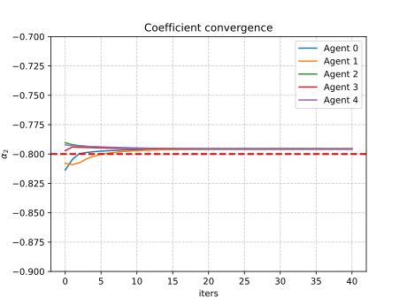
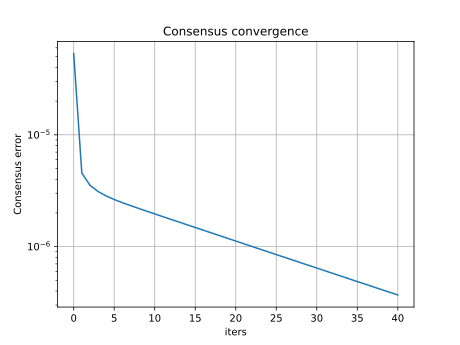
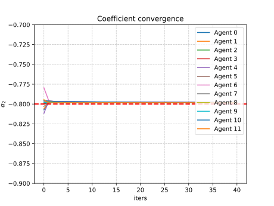

# Multi-Agent Optimization for Distributed Learning

Multi-agent optimization for distributed least-squares regression with some real-world complications.

<details>
<summary>Code organization</summary>

```bash
pip install -r requirements.txt
```

- `src/configs/` folder with yaml configuration files
- `src/logs/` folder automatically created
- `src/plots/` folder with plotted results (network, parameter convergence and consensus objective convergence)
- `src/cmd_args.py` arguments for main programs
- `src/main.py` main program with arguments, see `python main.py --help` (for now just the configuration file)
- `src/mydata.py` utilities for dataset creation
- `src/network.py` utilities for multi-agent network creation, contains `random_nodes()` `connect_agents()` `plot_network()` functions
- `src/train.py` utilities for agents training and consensus algorithm, contains `Agent` class and `consensus_algorithm()` function
- `src/utils.py` other utilities

You can run the main program as follows (also works for `network.py` and `mydata.py` for inspecting agents network and data respectively)

```bash
python src/main.py --config src/configs/exp1.yaml
```

Otherwise go for `chmod -x src/commands.sh` then run `src/commands.sh` for plotting the networks and then running consensus algorithm for each setting

</details>

## :spider_web: Distributed learning

The learning problem is the least-squares regression, it can be solved in closed form.

The complication here is that being a distributed problem, there are global features that are shared between all the agents and local features that only each agent has access to, which are specific of the local data. In this example we have 2 shared features (coefficients) and a single local feature (bias).

The idea is to solve the local least-squares problems and then align all the solution with the consensus algorithm like in a federated learning setting. See [math.pdf](math.pdf) for the mathematical part (markdown has problems rendering math formulas) and pseudocode too.

### :file_folder: Custom dataset

Here we consider the problem in which all agents share two common parameters and have a local bias. There are two types of covariates mixed together: $x_{1k},x_{2k}\sim\mathcal{U}([-10,10])$ and $x_{1k},x_{2k}\sim\mathcal{U}([-1,1])$, and $\varepsilon_k\sim\mathcal{N}(0,0.8)$. We explore two settings for each agent's samples:
- Each agent gets the same amount of samples `dataset: balanced`, hence the dataset is split equally
- Each agent gest a different amount of samples `dataset: unbalanced`, the samples are assigned randomly with `np.random.randint` for random splits

Common parameters are fixed $w=(0.5,-0.8)$ while $\beta_i\sim\mathcal{U}([-2,2])$.

### :busts_in_silhouette: Multi-agent system

We need to define a network topology and specify the number of agents, based on the topology there could be more parameters to set.

There are various possibilities, here we consider the **geometric** (named `random`, see `network.random_nodes()`) topology where the nodes are displayed randomly over the grid, and between two nodes there will be a connection if their distance is less than a given threshold.
<!-- - Geometric: generate random 2D coordinates the connect two agents if their distance is below a given threshold (see `network.random_nodes()`)
- Ring: display the nodes in a circle (see `network.ring_nodes`) as the previous the threshold should be provided here too -->

For example we can set in the YAML file: `topology: random` `n_agents: 10` `dist_thresh: 3.3` that corresponds to the geometric topology with 10 agents and a distance threshold of 3.3 between two agents under which they will be connected (added to the neighbors list respectively, available in `Agent.neighbors`).

When adding agents to the neighbors list, the `Agent.update_neighbors()` method must be called, this also updates the consensus weights for the current agent. We choose to use the Metropolis weights since we only want to exploit local informations available to all agents.

Having $\mathcal{N}_i$ as the list of neighbors for the agent $i$, we can access the neighbors list as follows

```python
agent_i = Agent(1, features_i, targets_i)
# get distance matric for the network topology
# connect agents given the network with network.connect_agents()
for neighbor in agent.neighbors:
    print(neighbor)  # see `__str__` method
    print(neighbor.metropolis)  # directly access metropolis weights
```

### :mailbox_with_mail: Consensus algorithm

The full dataset is split between each agent, i.e. each agent has a fraction of indices, this is handled with utilities in `mydata.py` when calling `get_dataset()` and using the `dataset_fun()` output from the main program. The output `agent_splits` is a list of dictionary where each containts local features and targets for each agent.

Once we have the data, we can proceed with solving the local least-squares problem as follows, where the `.fit()` method initializes variables for the consesus algorithm too.

```python
agents = [Agent(1, features_1, targets_1), Agent(2, features_2, targets_2)]
# get distance matrix for the network topology
# connect agents with `connect_agents()` updating neighbors list
for agent in agents:
    agent.fit()
    # automatically prints local solution w_i
    # then RMSE and R2 metrics using sklearn
```

Once we have the local solution for all agents (`agent.fit()`), we may proceed with the consensus algorithm for the common part of the weights, and then for the local bias

```python
for l in range(opts.maxiter):
    for agent in agents:
        # single consensus step for each agent
        # stores solution elsewhere util all agents make a step
        agent.consensus_step()
        # updates `q_1i_next` `omega_1i_next` (buffer)
    for agent in agents:
        # update consensus variables effectively
        agent.sync()
        # updates `q_1i` `omega_1i` `w_i`
    for agent in agents:
        # updates local bias stored in agent.mu_i_new[-1]
        agent.local_consensus()
```

## :chart_with_downwards_trend: Results

Working examples with results, for 3 considered networks

Network with 5 agents | Network with 12 agents | Network with 20 agents
-- | -- | --
 |  | 

### :one: Network with 5 agents

First row `balanced` setting, second row the `unbalanced` setting

err | $\alpha_1$ | $\alpha_2$ | $\beta_i$
--- | --- | --- | ---
 |  |  | 
 |  |  | 

<details>
<summary>Logging</summary>

See the configuration files for the [balanced](src/configs/balanced_random5.yaml) and [unbalanced](src/configs/unbalanced_random5.yaml) settings.

<table style="width:100%">
<tr>
  <th style="width:100px">Balanced setting</th>
  <th style="width:100%">Unbalanced setting</th>
</tr>
<tr>
<td>

```bash
python src/main.py --config src/configs/balanced_random5.yaml

Actual parameters:
Agent 0, w_i=[ 0.5    -0.8    -1.4839], samples=1000
Agent 1, w_i=[ 0.5    -0.8    -0.2787], samples=1000
Agent 2, w_i=[ 0.5    -0.8    -0.9012], samples=1000
Agent 3, w_i=[ 0.5   -0.8    1.551], samples=1000
Agent 4, w_i=[ 0.5    -0.8    -1.8377], samples=1000

Local least-squares:
Agent 0 local solution w_i=[ 0.5051 -0.8158 -1.5278], RMSE=0.83, R2=0.93
Agent 1 local solution w_i=[ 0.5056 -0.7946 -0.2842], RMSE=0.83, R2=0.93
Agent 2 local solution w_i=[ 0.5061 -0.8045 -0.8783], RMSE=0.83, R2=0.93
Agent 3 local solution w_i=[ 0.4942 -0.804   1.5345], RMSE=0.78, R2=0.94
Agent 4 local solution w_i=[ 0.5032 -0.8    -1.8503], RMSE=0.80, R2=0.93

After consensus:
Agent 0 local solution w_i=[ 0.5021 -0.8036 -1.5279], RMSE=0.83, R2=0.93
Agent 1 local solution w_i=[ 0.5021 -0.8036 -0.2839], RMSE=0.83, R2=0.93
Agent 2 local solution w_i=[ 0.5021 -0.8036 -0.8788], RMSE=0.83, R2=0.93
Agent 3 local solution w_i=[ 0.5021 -0.8036  1.5361], RMSE=0.78, R2=0.94
Agent 4 local solution w_i=[ 0.5021 -0.8035 -1.85  ], RMSE=0.80, R2=0.93
```

</td>
<td>

```bash
python src/main.py --config src/configs/unbalanced_random5.yaml

Actual parameters:
Agent 0, w_i=[ 0.5    -0.8    -0.5058], samples=1390
Agent 1, w_i=[ 0.5    -0.8     0.6799], samples=586
Agent 2, w_i=[ 0.5    -0.8    -1.7121], samples=1241
Agent 3, w_i=[ 0.5    -0.8    -0.9733], samples=1299
Agent 4, w_i=[ 0.5    -0.8     0.8556], samples=484

Local least-squares:
Agent 0 local solution w_i=[ 0.508  -0.7775 -0.4794], RMSE=0.79, R2=0.93
Agent 1 local solution w_i=[ 0.507  -0.8076  0.6746], RMSE=0.82, R2=0.93
Agent 2 local solution w_i=[ 0.5045 -0.8033 -1.7414], RMSE=0.80, R2=0.93
Agent 3 local solution w_i=[ 0.4949 -0.799  -0.9673], RMSE=0.80, R2=0.93
Agent 4 local solution w_i=[ 0.495  -0.8051  0.827 ], RMSE=0.82, R2=0.92

After consensus:
Agent 0 local solution w_i=[ 0.5015 -0.7959 -0.4795], RMSE=0.79, R2=0.93
Agent 1 local solution w_i=[ 0.5016 -0.7959  0.6785], RMSE=0.82, R2=0.93
Agent 2 local solution w_i=[ 0.5015 -0.796  -1.7417], RMSE=0.80, R2=0.93
Agent 3 local solution w_i=[ 0.5015 -0.796  -0.9673], RMSE=0.80, R2=0.93
Agent 4 local solution w_i=[ 0.5015 -0.796   0.8249], RMSE=0.82, R2=0.92
```

</td>
</tr>
</table>

</details>


### :two: Network with 12 agents

err | $\alpha_1$ | $\alpha_2$ | $\beta_i$
--- | --- | --- | ---
 |  |  | 
 |  |  | 

<details>
<summary>Logging</summary>

See the configuration files for the [balanced](src/configs/balanced_random12.yaml) and [unbalanced](src/configs/unbalanced_random12.yaml) settings.

<table>
<tr>
<th>Balanced setting</th>
<th>Unbalanced setting</th>
</tr>
<tr>
<td>

```bash
python src/main.py --config src/configs/balanced_random12.yaml

Actual parameters:
Agent 0, w_i=[ 0.5    -0.8    -0.5256], samples=1000
Agent 1, w_i=[ 0.5    -0.8     0.7044], samples=1000
Agent 2, w_i=[ 0.5    -0.8     0.1161], samples=1000
Agent 3, w_i=[ 0.5    -0.8    -0.4716], samples=1000
Agent 4, w_i=[ 0.5    -0.8    -0.1973], samples=1000
Agent 5, w_i=[ 0.5    -0.8    -1.9481], samples=1000
Agent 6, w_i=[ 0.5    -0.8     1.0821], samples=1000
Agent 7, w_i=[ 0.5   -0.8   -1.836], samples=1000
Agent 8, w_i=[ 0.5    -0.8     1.3173], samples=1000
Agent 9, w_i=[ 0.5   -0.8    0.164], samples=1000
Agent 10, w_i=[ 0.5    -0.8     0.1113], samples=1000
Agent 11, w_i=[ 0.5    -0.8     0.8183], samples=1000

Local least-squares:
Agent 0 local solution w_i=[ 0.4975 -0.8045 -0.4993], RMSE=0.73, R2=0.94
Agent 1 local solution w_i=[ 0.4901 -0.8028  0.699 ], RMSE=0.78, R2=0.93
Agent 2 local solution w_i=[ 0.4989 -0.817   0.0918], RMSE=0.78, R2=0.93
Agent 3 local solution w_i=[ 0.5034 -0.7831 -0.5055], RMSE=0.78, R2=0.94
Agent 4 local solution w_i=[ 0.4972 -0.7915 -0.1915], RMSE=0.79, R2=0.94
Agent 5 local solution w_i=[ 0.5041 -0.7811 -1.9141], RMSE=0.76, R2=0.93
Agent 6 local solution w_i=[ 0.502  -0.8266  1.0841], RMSE=0.77, R2=0.94
Agent 7 local solution w_i=[ 0.5003 -0.8037 -1.8269], RMSE=0.81, R2=0.93
Agent 8 local solution w_i=[ 0.4979 -0.7934  1.3539], RMSE=0.80, R2=0.93
Agent 9 local solution w_i=[ 0.4964 -0.802   0.1639], RMSE=0.80, R2=0.93
Agent 10 local solution w_i=[ 0.5033 -0.7958  0.1309], RMSE=0.80, R2=0.93
Agent 11 local solution w_i=[ 0.502  -0.8018  0.81  ], RMSE=0.82, R2=0.93

After consensus:
Agent 0 local solution w_i=[ 0.4997 -0.7997 -0.4993], RMSE=0.73, R2=0.94
Agent 1 local solution w_i=[ 0.4989 -0.8     0.6984], RMSE=0.78, R2=0.93
Agent 2 local solution w_i=[ 0.4989 -0.8     0.0939], RMSE=0.78, R2=0.93
Agent 3 local solution w_i=[ 0.4989 -0.8    -0.5072], RMSE=0.78, R2=0.93
Agent 4 local solution w_i=[ 0.5003 -0.7994 -0.1915], RMSE=0.79, R2=0.94
Agent 5 local solution w_i=[ 0.5002 -0.7995 -1.9133], RMSE=0.76, R2=0.93
Agent 6 local solution w_i=[ 0.5003 -0.7994  1.0861], RMSE=0.77, R2=0.94
Agent 7 local solution w_i=[ 0.4989 -0.8    -1.8269], RMSE=0.81, R2=0.93
Agent 8 local solution w_i=[ 0.4991 -0.7999  1.3535], RMSE=0.80, R2=0.93
Agent 9 local solution w_i=[ 0.4989 -0.8     0.1635], RMSE=0.80, R2=0.93
Agent 10 local solution w_i=[ 0.5003 -0.7994  0.1311], RMSE=0.80, R2=0.93
Agent 11 local solution w_i=[ 0.4989 -0.8     0.8102], RMSE=0.82, R2=0.93
```

</td>
<td>

```bash
python src/main.py --config src/configs/unbalanced_random12.yaml

Actual parameters:
Agent 0, w_i=[ 0.5    -0.8     0.1113], samples=134
Agent 1, w_i=[ 0.5    -0.8     0.8183], samples=505
Agent 2, w_i=[ 0.5    -0.8     1.4382], samples=590
Agent 3, w_i=[ 0.5    -0.8     1.7706], samples=968
Agent 4, w_i=[ 0.5    -0.8     0.1735], samples=1823
Agent 5, w_i=[ 0.5    -0.8    -1.3974], samples=1374
Agent 6, w_i=[ 0.5    -0.8     1.5145], samples=1840
Agent 7, w_i=[ 0.5    -0.8    -1.8373], samples=2249
Agent 8, w_i=[ 0.5    -0.8     1.2293], samples=413
Agent 9, w_i=[ 0.5    -0.8     0.7217], samples=523
Agent 10, w_i=[ 0.5    -0.8     1.6189], samples=1143
Agent 11, w_i=[ 0.5    -0.8     1.5899], samples=438

Local least-squares:
Agent 0 local solution w_i=[ 0.5227 -0.8354  0.0824], RMSE=0.68, R2=0.95
Agent 1 local solution w_i=[ 0.5038 -0.8217  0.8488], RMSE=0.75, R2=0.94
Agent 2 local solution w_i=[ 0.5111 -0.8053  1.4807], RMSE=0.74, R2=0.94
Agent 3 local solution w_i=[ 0.4963 -0.7834  1.7543], RMSE=0.78, R2=0.93
Agent 4 local solution w_i=[ 0.5041 -0.8019  0.1386], RMSE=0.78, R2=0.93
Agent 5 local solution w_i=[ 0.4981 -0.8016 -1.3862], RMSE=0.79, R2=0.94
Agent 6 local solution w_i=[ 0.5093 -0.8047  1.5307], RMSE=0.78, R2=0.94
Agent 7 local solution w_i=[ 0.501  -0.7958 -1.8176], RMSE=0.80, R2=0.93
Agent 8 local solution w_i=[ 0.4937 -0.7952  1.2577], RMSE=0.79, R2=0.93
Agent 9 local solution w_i=[ 0.5063 -0.7994  0.7563], RMSE=0.80, R2=0.93
Agent 10 local solution w_i=[ 0.495  -0.799   1.6182], RMSE=0.81, R2=0.93
Agent 11 local solution w_i=[ 0.4981 -0.7991  1.5569], RMSE=0.83, R2=0.92

After consensus:
Agent 0 local solution w_i=[ 0.5019 -0.8     0.025 ], RMSE=0.69, R2=0.95
Agent 1 local solution w_i=[ 0.5014 -0.7985  0.8533], RMSE=0.75, R2=0.94
Agent 2 local solution w_i=[ 0.5014 -0.7985  1.4818], RMSE=0.74, R2=0.94
Agent 3 local solution w_i=[ 0.5014 -0.7985  1.756 ], RMSE=0.79, R2=0.93
Agent 4 local solution w_i=[ 0.5022 -0.8009  0.1385], RMSE=0.78, R2=0.93
Agent 5 local solution w_i=[ 0.5021 -0.8008 -1.3853], RMSE=0.79, R2=0.94
Agent 6 local solution w_i=[ 0.5022 -0.8009  1.5302], RMSE=0.78, R2=0.94
Agent 7 local solution w_i=[ 0.5014 -0.7985 -1.8176], RMSE=0.80, R2=0.93
Agent 8 local solution w_i=[ 0.5016 -0.799   1.257 ], RMSE=0.79, R2=0.93
Agent 9 local solution w_i=[ 0.5014 -0.7985  0.7558], RMSE=0.80, R2=0.93
Agent 10 local solution w_i=[ 0.5022 -0.8009  1.616 ], RMSE=0.81, R2=0.93
Agent 11 local solution w_i=[ 0.5014 -0.7985  1.5591], RMSE=0.83, R2=0.92
```

</td>
</tr>
</table>

</details>


### :three: Network with 20 agents

err | $\alpha_1$ | $\alpha_2$ | $\beta_i$
--- | --- | --- | ---
 |  |  | 
 |  |  | 

<details>
<summary>Logging</summary>

See the configuration files for the [balanced](src/configs/balanced_random20.yaml) and [unbalanced](src/configs/unbalanced_random20.yaml) settings.

<table>
<tr>
<th>Balanced setting</th>
<th>Unbalanced setting</th>
</tr>
<tr>
<td>

```bash
python src/main.py --config src/configs/balanced_random20.yaml

Actual parameters:
Agent 0, w_i=[ 0.5    -0.8    -1.8764], samples=1000
Agent 1, w_i=[ 0.5    -0.8    -0.0773], samples=1000
Agent 2, w_i=[ 0.5   -0.8    1.182], samples=1000
Agent 3, w_i=[ 0.5    -0.8     0.5883], samples=1000
Agent 4, w_i=[ 0.5    -0.8     1.8653], samples=1000
Agent 5, w_i=[ 0.5    -0.8     1.3731], samples=1000
Agent 6, w_i=[ 0.5    -0.8     0.1062], samples=1000
Agent 7, w_i=[ 0.5    -0.8    -1.1739], samples=1000
Agent 8, w_i=[ 0.5    -0.8    -1.9849], samples=1000
Agent 9, w_i=[ 0.5   -0.8    1.922], samples=1000
Agent 10, w_i=[ 0.5    -0.8     1.7533], samples=1000
Agent 11, w_i=[ 0.5    -0.8    -0.9034], samples=1000
Agent 12, w_i=[ 0.5    -0.8     0.5529], samples=1000
Agent 13, w_i=[ 0.5   -0.8    0.917], samples=1000
Agent 14, w_i=[ 0.5    -0.8     0.3121], samples=1000
Agent 15, w_i=[ 0.5    -0.8     1.3718], samples=1000
Agent 16, w_i=[ 0.5    -0.8    -1.6887], samples=1000
Agent 17, w_i=[ 0.5   -0.8    1.586], samples=1000
Agent 18, w_i=[ 0.5    -0.8    -0.4319], samples=1000
Agent 19, w_i=[ 0.5    -0.8    -0.0772], samples=1000

Local least-squares:
Agent 0 local solution w_i=[ 0.5046 -0.7984 -1.8653], RMSE=0.80, R2=0.93
Agent 1 local solution w_i=[ 0.5029 -0.801  -0.0571], RMSE=0.79, R2=0.93
Agent 2 local solution w_i=[ 0.504  -0.8123  1.1633], RMSE=0.81, R2=0.93
Agent 3 local solution w_i=[ 0.5061 -0.8194  0.5994], RMSE=0.82, R2=0.93
Agent 4 local solution w_i=[ 0.4945 -0.8003  1.8561], RMSE=0.84, R2=0.93
Agent 5 local solution w_i=[ 0.4915 -0.8161  1.343 ], RMSE=0.81, R2=0.93
Agent 6 local solution w_i=[ 0.4966 -0.7962  0.0993], RMSE=0.79, R2=0.93
Agent 7 local solution w_i=[ 0.498  -0.7999 -1.1855], RMSE=0.80, R2=0.93
Agent 8 local solution w_i=[ 0.4936 -0.8069 -1.9928], RMSE=0.81, R2=0.93
Agent 9 local solution w_i=[ 0.5151 -0.8164  1.9148], RMSE=0.77, R2=0.94
Agent 10 local solution w_i=[ 0.4919 -0.8034  1.7081], RMSE=0.81, R2=0.93
Agent 11 local solution w_i=[ 0.4912 -0.7945 -0.8693], RMSE=0.80, R2=0.93
Agent 12 local solution w_i=[ 0.4903 -0.7956  0.593 ], RMSE=0.77, R2=0.94
Agent 13 local solution w_i=[ 0.5069 -0.8023  0.9172], RMSE=0.82, R2=0.92
Agent 14 local solution w_i=[ 0.5038 -0.8033  0.3373], RMSE=0.82, R2=0.93
Agent 15 local solution w_i=[ 0.4988 -0.7956  1.3336], RMSE=0.81, R2=0.92
Agent 16 local solution w_i=[ 0.4983 -0.7851 -1.6951], RMSE=0.80, R2=0.93
Agent 17 local solution w_i=[ 0.4919 -0.7704  1.5949], RMSE=0.79, R2=0.92
Agent 18 local solution w_i=[ 0.5057 -0.8263 -0.4102], RMSE=0.82, R2=0.93
Agent 19 local solution w_i=[ 0.5048 -0.8042 -0.0513], RMSE=0.81, R2=0.93

After consensus:
Agent 0 local solution w_i=[ 0.4995 -0.8025 -1.8651], RMSE=0.80, R2=0.93
Agent 1 local solution w_i=[ 0.4996 -0.8012 -0.0577], RMSE=0.79, R2=0.93
Agent 2 local solution w_i=[ 0.4996 -0.8012  1.1603], RMSE=0.81, R2=0.93
Agent 3 local solution w_i=[ 0.4995 -0.8015  0.5961], RMSE=0.82, R2=0.93
Agent 4 local solution w_i=[ 0.4994 -0.8028  1.8563], RMSE=0.84, R2=0.93
Agent 5 local solution w_i=[ 0.4993 -0.8033  1.345 ], RMSE=0.81, R2=0.93
Agent 6 local solution w_i=[ 0.4995 -0.8029  0.0986], RMSE=0.79, R2=0.93
Agent 7 local solution w_i=[ 0.4996 -0.8012 -1.1847], RMSE=0.80, R2=0.93
Agent 8 local solution w_i=[ 0.4995 -0.8021 -1.9912], RMSE=0.81, R2=0.93
Agent 9 local solution w_i=[ 0.4996 -0.8012  1.9159], RMSE=0.78, R2=0.94
Agent 10 local solution w_i=[ 0.4994 -0.8032  1.7079], RMSE=0.82, R2=0.93
Agent 11 local solution w_i=[ 0.4996 -0.8012 -0.8676], RMSE=0.80, R2=0.93
Agent 12 local solution w_i=[ 0.4996 -0.8012  0.5927], RMSE=0.77, R2=0.94
Agent 13 local solution w_i=[ 0.4993 -0.8034  0.9176], RMSE=0.82, R2=0.92
Agent 14 local solution w_i=[ 0.4993 -0.8034  0.3376], RMSE=0.82, R2=0.93
Agent 15 local solution w_i=[ 0.4993 -0.8033  1.3331], RMSE=0.81, R2=0.92
Agent 16 local solution w_i=[ 0.4995 -0.8028 -1.6942], RMSE=0.80, R2=0.93
Agent 17 local solution w_i=[ 0.4996 -0.8011  1.5929], RMSE=0.79, R2=0.92
Agent 18 local solution w_i=[ 0.4995 -0.8024 -0.4105], RMSE=0.82, R2=0.92
Agent 19 local solution w_i=[ 0.4995 -0.8027 -0.052 ], RMSE=0.81, R2=0.93
```

</td>
<td>

```bash
python src/main.py --config src/configs/unbalanced_random20.yaml

Actual parameters:
Agent 0, w_i=[ 0.5    -0.8    -1.6887], samples=1239
Agent 1, w_i=[ 0.5   -0.8    1.586], samples=850
Agent 2, w_i=[ 0.5    -0.8    -0.4319], samples=255
Agent 3, w_i=[ 0.5    -0.8    -0.0772], samples=3544
Agent 4, w_i=[ 0.5    -0.8    -0.2211], samples=153
Agent 5, w_i=[ 0.5    -0.8     0.1251], samples=816
Agent 6, w_i=[ 0.5    -0.8     0.3927], samples=332
Agent 7, w_i=[ 0.5    -0.8     0.8414], samples=308
Agent 8, w_i=[ 0.5    -0.8     0.0998], samples=746
Agent 9, w_i=[ 0.5    -0.8     0.7391], samples=2378
Agent 10, w_i=[ 0.5    -0.8    -0.6468], samples=1828
Agent 11, w_i=[ 0.5    -0.8     1.7467], samples=992
Agent 12, w_i=[ 0.5    -0.8    -1.7419], samples=44
Agent 13, w_i=[ 0.5    -0.8     0.1822], samples=937
Agent 14, w_i=[ 0.5    -0.8    -1.6504], samples=1757
Agent 15, w_i=[ 0.5    -0.8    -0.2289], samples=1684
Agent 16, w_i=[ 0.5    -0.8    -0.9697], samples=354
Agent 17, w_i=[ 0.5    -0.8     1.7476], samples=1161
Agent 18, w_i=[ 0.5    -0.8    -1.9477], samples=347
Agent 19, w_i=[ 0.5    -0.8    -0.4352], samples=275

Local least-squares:
Agent 0 local solution w_i=[ 0.4987 -0.7964 -1.6642], RMSE=0.79, R2=0.93
Agent 1 local solution w_i=[ 0.5016 -0.7856  1.5689], RMSE=0.81, R2=0.93
Agent 2 local solution w_i=[ 0.5158 -0.7965 -0.457 ], RMSE=0.84, R2=0.93
Agent 3 local solution w_i=[ 0.4985 -0.8015 -0.0801], RMSE=0.82, R2=0.93
Agent 4 local solution w_i=[ 0.475  -0.7944 -0.3603], RMSE=0.78, R2=0.93
Agent 5 local solution w_i=[ 0.4928 -0.7938  0.1156], RMSE=0.79, R2=0.93
Agent 6 local solution w_i=[ 0.4911 -0.8027  0.3649], RMSE=0.80, R2=0.93
Agent 7 local solution w_i=[ 0.5023 -0.82    0.848 ], RMSE=0.85, R2=0.92
Agent 8 local solution w_i=[ 0.5055 -0.8114  0.1151], RMSE=0.79, R2=0.94
Agent 9 local solution w_i=[ 0.5031 -0.7994  0.7245], RMSE=0.80, R2=0.93
Agent 10 local solution w_i=[ 0.5003 -0.8021 -0.6299], RMSE=0.79, R2=0.93
Agent 11 local solution w_i=[ 0.4979 -0.8096  1.7366], RMSE=0.81, R2=0.93
Agent 12 local solution w_i=[ 0.5422 -0.7173 -1.8661], RMSE=0.75, R2=0.89
Agent 13 local solution w_i=[ 0.5099 -0.8046  0.2213], RMSE=0.82, R2=0.93
Agent 14 local solution w_i=[ 0.4985 -0.7951 -1.668 ], RMSE=0.82, R2=0.92
Agent 15 local solution w_i=[ 0.5021 -0.8051 -0.2092], RMSE=0.78, R2=0.93
Agent 16 local solution w_i=[ 0.5038 -0.7953 -1.0049], RMSE=0.82, R2=0.92
Agent 17 local solution w_i=[ 0.4985 -0.8109  1.7588], RMSE=0.83, R2=0.92
Agent 18 local solution w_i=[ 0.496  -0.8141 -1.9055], RMSE=0.78, R2=0.93
Agent 19 local solution w_i=[ 0.4933 -0.8207 -0.3997], RMSE=0.84, R2=0.94

After consensus:
Agent 0 local solution w_i=[ 0.5003 -0.8015 -1.664 ], RMSE=0.79, R2=0.93
Agent 1 local solution w_i=[ 0.501  -0.8019  1.5694], RMSE=0.81, R2=0.93
Agent 2 local solution w_i=[ 0.501  -0.8019 -0.459 ], RMSE=0.84, R2=0.93
Agent 3 local solution w_i=[ 0.5009 -0.8018 -0.0801], RMSE=0.82, R2=0.93
Agent 4 local solution w_i=[ 0.5002 -0.8013 -0.4277], RMSE=0.78, R2=0.93
Agent 5 local solution w_i=[ 0.5    -0.8011  0.1138], RMSE=0.80, R2=0.93
Agent 6 local solution w_i=[ 0.5001 -0.8014  0.3655], RMSE=0.80, R2=0.93
Agent 7 local solution w_i=[ 0.5011 -0.8019  0.8359], RMSE=0.85, R2=0.92
Agent 8 local solution w_i=[ 0.5005 -0.8016  0.112 ], RMSE=0.80, R2=0.94
Agent 9 local solution w_i=[ 0.5011 -0.8019  0.7245], RMSE=0.80, R2=0.93
Agent 10 local solution w_i=[ 0.5001 -0.8012 -0.63  ], RMSE=0.79, R2=0.93
Agent 11 local solution w_i=[ 0.5011 -0.8019  1.7354], RMSE=0.81, R2=0.93
Agent 12 local solution w_i=[ 0.501  -0.8019 -2.1335], RMSE=0.83, R2=0.87
Agent 13 local solution w_i=[ 0.5    -0.8011  0.2209], RMSE=0.82, R2=0.93
Agent 14 local solution w_i=[ 0.5    -0.8011 -1.6683], RMSE=0.82, R2=0.92
Agent 15 local solution w_i=[ 0.5    -0.8011 -0.2093], RMSE=0.78, R2=0.93
Agent 16 local solution w_i=[ 0.5002 -0.8014 -1.0115], RMSE=0.82, R2=0.92
Agent 17 local solution w_i=[ 0.5011 -0.8019  1.7583], RMSE=0.83, R2=0.92
Agent 18 local solution w_i=[ 0.5004 -0.8015 -1.9051], RMSE=0.78, R2=0.93
Agent 19 local solution w_i=[ 0.5002 -0.8014 -0.374 ], RMSE=0.84, R2=0.93
```
</td>
</tr>
</table>

</details>
