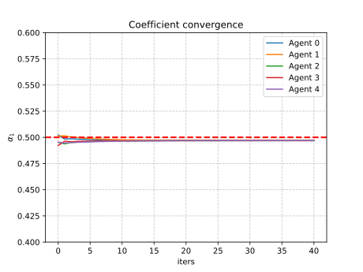
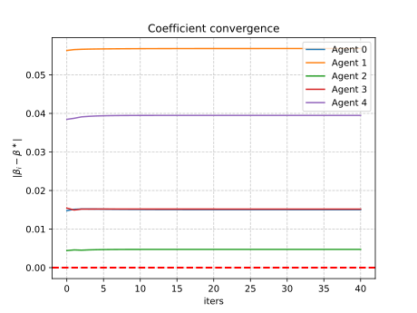
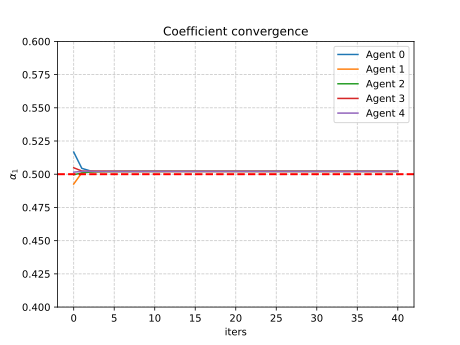
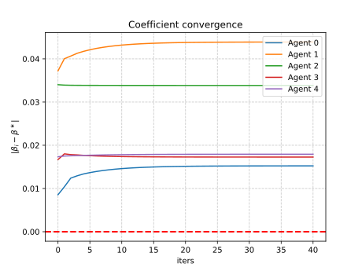
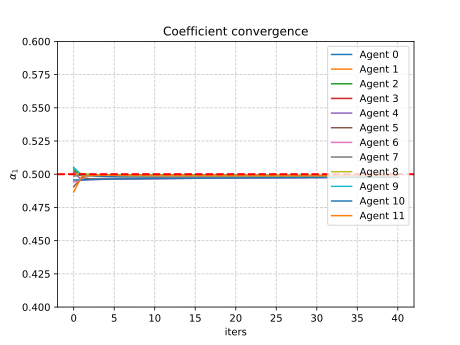
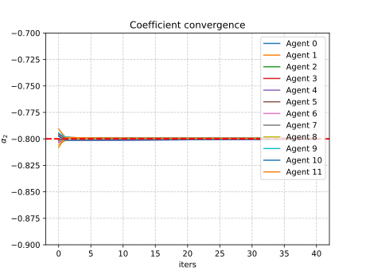
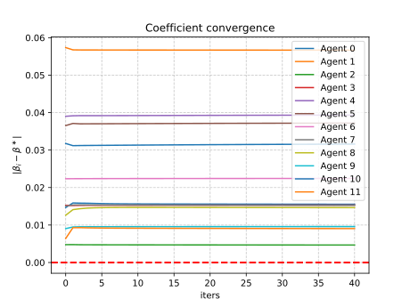
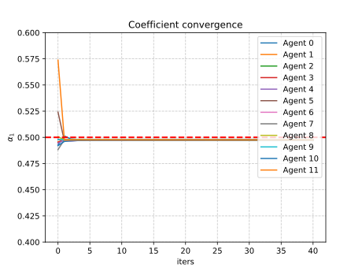
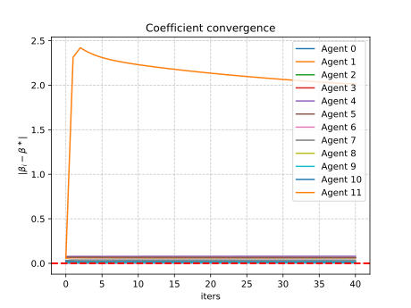

# Multi-Agent Optimization for Distributed Learning

Multi-agent optimization for distributed least-squares regression with some real-world complications.

<details>
<summary>Code organization</summary>

```bash
pip install -r requirements.txt
```

- `src/configs/` folder with yaml configuration files
- `src/logs/` folder automatically created
- `src/plots/` folder with plotted results (network, parameter convergence and consensus objective convergence)
- `src/cmd_args.py` arguments for main programs
- `src/main.py` main program with arguments, see `python main.py --help` (for now just the configuration file)
- `src/mydata.py` utilities for dataset creation
- `src/network.py` utilities for multi-agent network creation, contains `random_nodes()` `connect_agents()` `plot_network()` functions
- `src/train.py` utilities for agents training and consensus algorithm, contains `Agent` class and `consensus_algorithm()` function
- `src/utils.py` other utilities

You can run the main program as follows (also works for `network.py` and `mydata.py` for inspecting agents network and data respectively)

```bash
python src/main.py --config src/configs/exp1.yaml
```

Otherwise go for `chmod +x src/commands.sh` then run `src/commands.sh` for plotting the networks and then running consensus algorithm for each setting

</details>

## :spider_web: Distributed learning

The learning problem is the least-squares regression, it can be solved in closed form.

The complication here is that being a distributed problem, there are global features that are shared between all the agents and local features that only each agent has access to, which are specific of the local data. In this example we have 2 shared features (coefficients) and a single local feature (bias).

The idea is to solve the local least-squares problems and then align all the solution with the consensus algorithm like in a federated learning setting. See [math.pdf](math.pdf) for the mathematical part (markdown has problems rendering math formulas) and pseudocode too.

### :file_folder: Custom dataset

Here we consider the problem in which all agents share two common parameters and have a local bias. There are two types of covariates mixed together: $x_{1k},x_{2k}\sim\mathcal{U}([-10,10])$ and $x_{1k},x_{2k}\sim\mathcal{U}([-1,1])$, and $\varepsilon_k\sim\mathcal{N}(0,0.8)$. We explore two settings for each agent's samples:
- Each agent gets the same amount of samples `dataset: balanced`, hence the dataset is split equally
- Each agent gest a different amount of samples `dataset: unbalanced`, the samples are assigned randomly with `np.random.randint` for random splits

Common parameters are fixed $w=(0.5,-0.8)$ while $\beta_i\sim\mathcal{U}([-2,2])$.

### :busts_in_silhouette: Multi-agent system

We need to define a network topology and specify the number of agents, based on the topology there could be more parameters to set.

There are various possibilities, here we consider the **geometric** (named `random`, see `network.random_nodes()`) topology where the nodes are displayed randomly over the grid, and between two nodes there will be a connection if their distance is less than a given threshold.
<!-- - Geometric: generate random 2D coordinates the connect two agents if their distance is below a given threshold (see `network.random_nodes()`)
- Ring: display the nodes in a circle (see `network.ring_nodes`) as the previous the threshold should be provided here too -->

For example we can set in the YAML file: `topology: random` `n_agents: 10` `dist_thresh: 3.3` that corresponds to the geometric topology with 10 agents and a distance threshold of 3.3 between two agents under which they will be connected (added to the neighbors list respectively, available in `Agent.neighbors`).

When adding agents to the neighbors list, the `Agent.update_neighbors()` method must be called, this also updates the consensus weights for the current agent. We choose to use the Metropolis weights since we only want to exploit local informations available to all agents.

Having $\mathcal{N}_i$ as the list of neighbors for the agent $i$, we can access the neighbors list as follows

```python
agent_i = Agent(1, features_i, targets_i)
# get distance matric for the network topology
# connect agents given the network with network.connect_agents()
for neighbor in agent.neighbors:
    print(neighbor)  # see `__str__` method
    print(neighbor.metropolis)  # directly access metropolis weights
```

### :mailbox_with_mail: Consensus algorithm

The full dataset is split between each agent, i.e. each agent has a fraction of indices, this is handled with utilities in `mydata.py` when calling `get_dataset()` and using the `dataset_fun()` output from the main program. The output `agent_splits` is a list of dictionary where each containts local features and targets for each agent.

Once we have the data, we can proceed with solving the local least-squares problem as follows, where the `.fit()` method initializes variables for the consesus algorithm too.

```python
agents = [Agent(1, features_1, targets_1), Agent(2, features_2, targets_2)]
# get distance matrix for the network topology
# connect agents with `connect_agents()` updating neighbors list
for agent in agents:
    agent.fit()
    # automatically prints local solution w_i
    # then RMSE and R2 metrics using sklearn
```

Once we have the local solution for all agents (`agent.fit()`), we may proceed with the consensus algorithm for the common part of the weights, and then for the local bias

```python
for l in range(opts.maxiter):
    for agent in agents:
        # single consensus step for each agent
        # stores solution elsewhere util all agents make a step
        agent.consensus_step()
        # updates `q_1i_next` `omega_1i_next` (buffer)
    for agent in agents:
        # update consensus variables effectively
        agent.sync()
        # updates `q_1i` `omega_1i` `w_i`
    for agent in agents:
        # updates local bias stored in agent.mu_i_new[-1]
        agent.local_consensus()
```

## :chart_with_downwards_trend: Results

Working examples with results, for 3 considered networks

Network with 5 agents | Network with 12 agents
-- | --
 | 

### :one: Network with 5 agents

First row `balanced` setting, second row the `unbalanced` setting

err | $\alpha_1$ | $\alpha_2$ | $\beta_i$
--- | --- | --- | ---
 |  |  | 
 |  |  | 

<details>
<summary>Logging</summary>

See the configuration files for the [balanced](src/configs/balanced_random5.yaml) and [unbalanced](src/configs/unbalanced_random5.yaml) settings.

<table style="width:100%">
<tr>
  <th style="width:100px">Balanced setting</th>
  <th style="width:100%">Unbalanced setting</th>
</tr>
<tr>
<td>

```bash
python src/main.py --config src/configs/balanced_random5.yaml

```

</td>
<td>

```bash
python src/main.py --config src/configs/unbalanced_random5.yaml


```

</td>
</tr>
</table>

</details>


### :two: Network with 12 agents

err | $\alpha_1$ | $\alpha_2$ | $\beta_i$
--- | --- | --- | ---
 |  |  | 
 |  |  | 

<details>
<summary>Logging</summary>

See the configuration files for the [balanced](src/configs/balanced_random12.yaml) and [unbalanced](src/configs/unbalanced_random12.yaml) settings.

<table>
<tr>
<th>Balanced setting</th>
<th>Unbalanced setting</th>
</tr>
<tr>
<td>

```bash
python src/main.py --config src/configs/balanced_random12.yaml

```

</td>
<td>

```bash
python src/main.py --config src/configs/unbalanced_random12.yaml

```

</td>
</tr>
</table>

</details>
